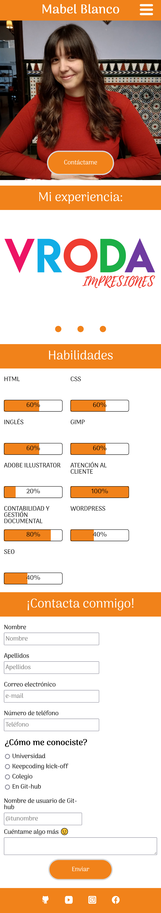
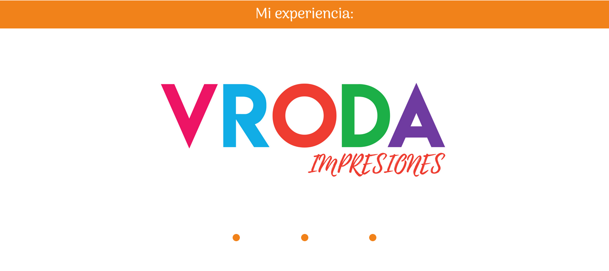
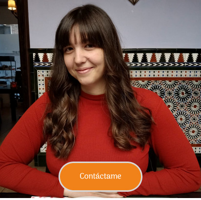
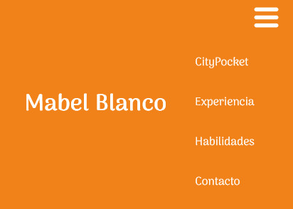

# MI PORTFOLIO #

Este proyecto es un portfolio sobre mí. **Está hecho únicamente utilizando HTML y CSS.**

Para la sección "Experiencia" he utilizado las diferentes empresas que he montado a lo largo de mi vida laboral. Aunque no son mi única experiencia de trabajo, si son las que más me representan.

Para la página extra he utilizado una de las empresas anteriormente mencionadas: *CityPocket.* Este fue de todos el proyecto en el que más implicación emocional he tenido, ya que conllevaba también una lucha social: la ayuda al pequeño comercio. Así que le he querido rendir este pequeño homenaje.

## RESULTADO ##

El resultado final es el siguiente:

### Versión movile ###

  
  

### Versión Escritorio ###

  
  

## ORGANIZACIÓN ##

Tanto las páginas web como el readme.md que estáis leyendo, se encuentran fuera de carpetas porque me ha parecido más visual. El resto de archivos si están divididos en carpetas en función del tipo de archivo (css, iconos, imágenes, y vídeos).

### Organización CSS ###

- Dentro de la carpeta CSS se incluyen 2 básicos (reset y normalize) que son utilizados para que la visualización en todos los navegadores se unifique. 
- El resto de CSS corresponden a las distintas secciones de las páginas web, para que sea más sencillo localizar el código a cambiar en caso de necesidad. 
- La única excepción es el CSS "citypocket". En éste último he colocado el código que solo atañe a la pág citypocket. 
- El CSS base es el que lleva el nombre de "main".

## PUNTOS SOLICITADOS EN EL PROYECTO ##

Para este proyecto se solicitaban ciertos requisitos básicos:

- Utilizar solo código HTML y CSS, sin librerías ni frameworks y **sin javascript.**
- Que se visualizase correctamente en cualquier navegador.
- Incluir una barra de navegación con links a cada elemento de la página con un hover suavizado mediante transiciones.
- Que el header llevase una imagen responsive, optimizada para distintas resoluciones.
- Crear un carrusel mediante el uso de flexbox.

- Crear unas barras de progreso animadas con CSS.
- Colocar un formulario de contacto con: campos requeridos, radio-buttons, longitud máxima y pattern. Darle a cada input su tipo correcto.
- Colocar un footer con link a nuestras RRSS.
- Crear una página extra en cuyo interior utilizásemos el *display:Grid* para colocar los ítems.
- **MOVILE FIRST.** El diseño debe ser responsive, de modo que se deben utilizar media queries teniendo que tener muy en cuenta este último punto.

## PUNTOS AÑADIDOS ##

**No se solicitaban expresamente**, pero dado que lo hemos visto en clase lo he querido poner en práctica:

- Uso de og-tags.
- Incluir un tipo de fuente diferente al estándar.
- Botón (link) con posición absoluta dentro de imagen.

- Footer en página extra posicionado siempre abajo de la pantalla (fixed).
- Menú hamburguesa en la opción movile, ya que el menú completo haría que el nav quedase demasiado colapsado.

Este sería el menú cerrado:

Este sería el menú abierto:

